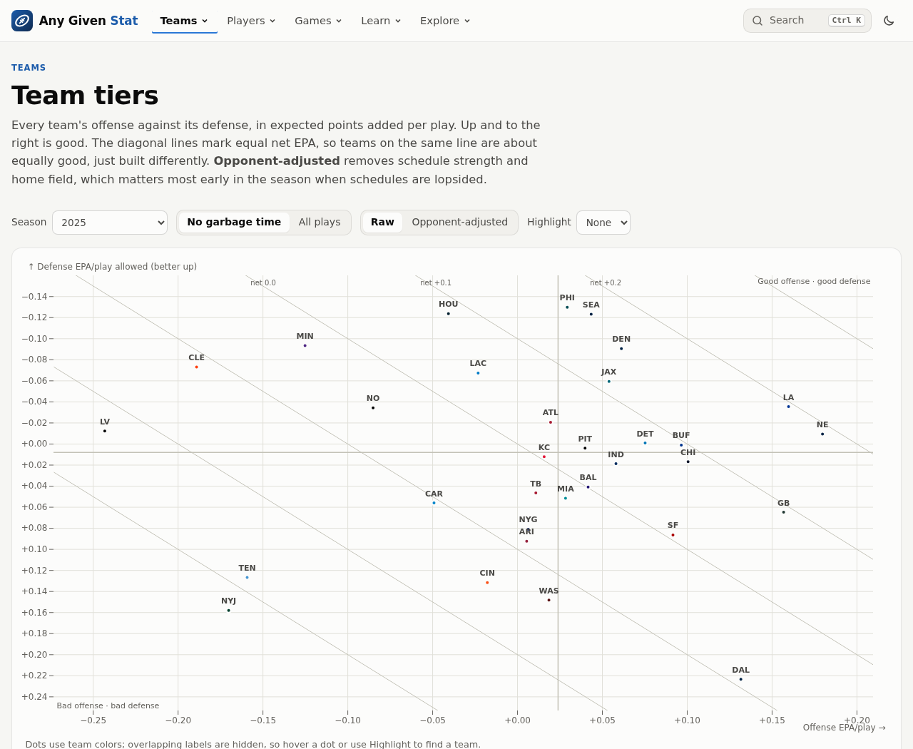

# Any Given Stat

NFL analytics built on every play since 2016: team tiers, quarterback efficiency with confidence
intervals, luck, a SQL console that runs in your browser, and a page that measures which football
stats are signal and which are noise.

**Live site:** https://brandon-kimberly.github.io/any-given-stat/ (rebuilt daily during the season)



## What's in it

| Page | Question it answers |
|---|---|
| **Team tiers** | Who is actually good? Offense vs defense EPA/play, raw or opponent-adjusted, with equal-net-EPA tier lines. |
| **Power ratings** | Opponent-adjusted, recency-weighted team ratings in points, week by week. |
| **Predictions** | Model spreads for the coming week vs the Vegas line, plus a walk-forward backtest and calibration check. |
| **Teams / team detail** | Every efficiency stat by team, situational splits (down, field position, score, quarter), strength of schedule, weekly trends, game logs. |
| **Quarterbacks** | EPA per dropback vs CPOE, plus 95% intervals that show when two QBs can't be told apart yet. |
| **Receivers / Rushers** | Usage (target share, air yards share, WOPR) and efficiency over expectation (xYAC, catch rate). |
| **Luck** | Record vs Pythagorean expectation, one-score games, fumble recovery, and how much luck reverses next season. |
| **Signal vs noise** | Split-half and year-over-year reliability for 20 stats, and the sample size where each becomes half signal. |
| **SQL explorer** | DuckDB compiled to WebAssembly, querying play-by-play parquet in the browser. Ten preset questions. |

## Findings the site makes easy to defend

Measured on 2016–2025 regular seasons, garbage time excluded (see *Signal vs noise*):

- **Offense is real, defense is shakier.** Offensive EPA/play has a split-half r of 0.50 (full-season
  reliability 0.67). Defense is 0.27 (0.43).
- **Passing beats rushing at predicting itself.** Team pass EPA r = 0.41, rush EPA r = 0.30. Individual
  rusher EPA/carry carries over year to year at only r = 0.06.
- **Some favorite talking points are close to random:** red zone TD rate (r = 0.09), offensive turnover
  rate (0.09), QB interception rate (0.05), fumble recovery rate (−0.02).
- **Public data doesn't beat the closing line, even with QB injuries modeled.** A walk-forward
  ridge model with a starting-QB adjustment missed final margins by 10.00 points on held-out
  2024–2025 (Vegas: 9.67). In a pre-registered attempt (6 variants × 4 bet thresholds, chosen on
  2022–2023), the winning strategy went 87–83 (51.2%) on the sealed test seasons: p = 0.65 against
  the 52.4% break-even. Models given the line as an input put ~95% weight on it and add nothing.
- **Luck reverses.** Teams that beat their Pythagorean record by 2+ wins averaged about 3 fewer wins the
  next season.


## How it works

```
nflverse play-by-play (parquet, ~20 MB/season) + schedules with closing lines (games.csv)
        │  pipeline/ — Python + DuckDB
        ▼
canonical filtered views (db.py) ──► datasets.py ──► web/static/data/*.json
                                                └──► web/static/data/pbp/pbp_<season>.parquet (slim)
        │  web/ — SvelteKit (static) + Observable Plot + DuckDB-WASM
        ▼
static site on GitHub Pages, rebuilt by a scheduled GitHub Action
```

- **No server.** All aggregation happens at build time in DuckDB SQL. The site is static files, and
  ad-hoc queries run in the visitor's browser.
- **One definition of a play.** Every dataset builds on the views in `pipeline/src/ags/db.py`
  (scrimmage plays, the garbage-time filter, drives, games), so numbers agree across pages.
- **No look-ahead, no peeking.** Ratings for week *w* use only games before week *w*. Coefficients
  are fit on 2017–2021, model choices made on 2022–2023, and 2024–2025 is scored once
  (`pipeline/src/ags/market.py`).
- **Tested math.** Metric logic is unit-tested against hand-computed answers on synthetic play-by-play
  (`pipeline/tests`), and every SQL explorer preset is executed against real data in CI.

## Run it locally

Requires Python 3.11+, [uv](https://docs.astral.sh/uv/) and Node 22.

```bash
cd pipeline && uv sync && uv run ags build   # downloads 2016–current (~200 MB, cached in data/raw)
cd ../web && npm install && npm run dev      # http://localhost:5173
```

On Windows PowerShell 5.1 (which doesn't support `&&`), run the steps one per line:

```powershell
cd pipeline
uv sync
uv run ags build
cd ..\web
npm install
npm run dev
```

`uv run ags build --seasons 2024-2025` builds a subset. Tests: `uv run pytest` (pipeline) and
`npm test && npm run check` (web).

## Data and credits

Play-by-play, EPA, win probability, CPOE, xYAC and xpass come from
[nflverse](https://github.com/nflverse/nflverse-data) and the
[nflfastR](https://www.nflfastr.com/) models. This project is not affiliated with the NFL.
